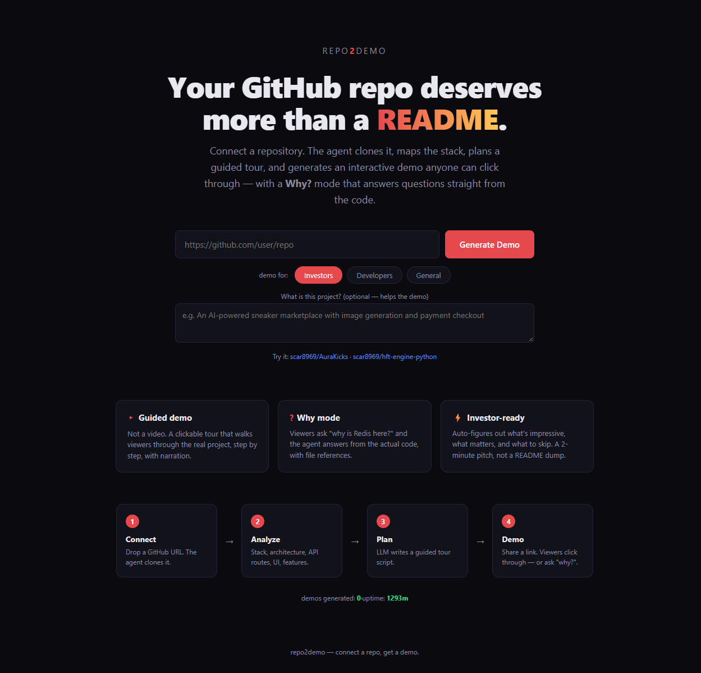
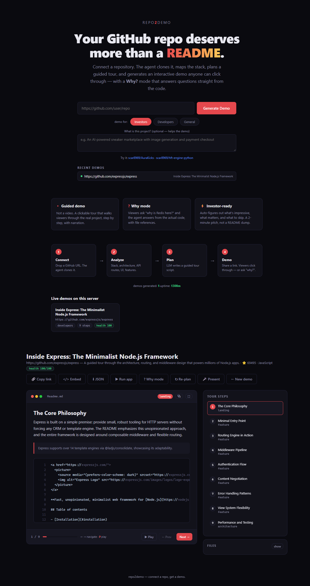

<p align="center">
  
  
  
  
  
  
</p>

<h1 align="center">
  Your GitHub repo deserves more than a README.<br>
  <em>Connect it. Get a demo.</em>
</h1>

<p align="center">
  <b>repo2demo</b> is an AI agent that clones <b>any public GitHub repo</b>,<br>
  maps the stack / architecture / routes / database / UI / features<br>
  using <b>52 detection patterns</b>, and generates a guided interactive<br>
  demo in <b>~20–30 seconds</b>.
</p>

<p align="center">
  
</p>

---

## Benchmarks

Every number is from a live run on commodity hardware (no GPUs, stdlib-only analysis).

| Repo | Stars | Steps | Health | Build time | Stack detected |
|------|-------|-------|--------|------------|----------------|
| [expressjs/express](https://github.com/expressjs/express) | 69,495 | 9 | 93/100 | 33s | express, javascript, node, react |
| [scar8969/repo2demo](https://github.com/scar8969/repo2demo) | — | 9 | **100/100** | 22s | fastapi, python, html, flask |
| [scar8969/Varuna](https://github.com/scar8969/Varuna) | — | 8 | 100/100 | 27s | python, html (ROV control system) |

> **Health score** = (file-hits / total steps) × 60% + (valid-targets / total steps) × 40%.  
> A score of 100 means every step in the plan references a real file in the repo.

---

## The demo

<p align="center">
  
</p>

The player above shows **expressjs/express** (⭐ 69,495, JavaScript). It's real — the
title, star count, and 9-step tour were generated by the agent. Every step references
an actual file in the repo.

### Tour layout

| Area | What you see |
|------|-------------|
| **Top bar** | Title, repo URL, star count, language, health badge, 8 action buttons |
| **Left pane** | Step narration + highlighted code with line numbers + detail callouts |
| **Right rail** | Clickable 9-step tour (landing → entrypoint → routing → middleware → ... → architecture) |
| **Bottom** | Progress bar, Play/Pause, Prev/Next, keyboard hints |

---

## Why? mode — ask the code anything

> **Q:** *"how does express routing work under the hood?"*
>
> **A:** Express routing works by delegating to a separate `Router` module. In
> `lib/application.js`, the app lazily creates a `Router` instance (lines ~40–50)
> with options for `caseSensitive` and `strict` routing. The `app.get()`, `app.post()`,
> etc. methods delegate to this router. The router handles matching HTTP methods
> and URL paths, then dispatches to the registered handler callbacks.
>
> **Refs:** `lib/application.js`, `History.md`, `Readme.md`, `lib/response.js`,
> `examples/view-locals/index.js`

Each answer is **grounded in actual code excerpts** with file paths and line numbers.
No hallucinations — the agent only answers from what it finds in the repo.
Secrets (API keys, passwords, tokens, private keys) are **redacted before the LLM receives them**.

---

## Dogfood — repo2demo analyzes itself

```
$ python cli.py https://github.com/scar8969/repo2demo --audience developers

[1/4] cloning ...
[2/4] analyzing ...    16 files · stack: fastapi, python, flask, html
[3/4] planning demo for developers ...
      title: Inside repo2demo: From Clone to Guided Tour
      steps: 9 · health: 100/100
      saved to demo.json
done in 22.3s
```

It scored **100/100** on itself — every step maps to a real backend or frontend file.
The generated demo walks through the analyzer, planner, why-mode engine, runner, and UI layer.

---

## Quick start

```bash
pip install fastapi uvicorn pydantic httpx
export R2D_API_KEY="your-key"         # or OPENAI_API_KEY
python main.py                        # → http://127.0.0.1:8766
```

Windows: `run.bat`

---

## CLI

```bash
$ python cli.py https://github.com/expressjs/express --audience developers

[1/4] cloning ...
[2/4] analyzing ...    1356 files · stack: express, javascript, node, react
[3/4] planning demo for developers ...
      title: Inside Express.js   steps: 9 · health: 93/100
      saved to demo.json
done in 33.3s
```

---

## Architecture

```
backend/          FastAPI — 1,526 Python lines, 57 functions
  server.py       jobs, cache, restore, rate limit, proxy, CORS, TTL cleanup
  analyzer.py     clone + static analysis (stack, entrypoints, routes, DB, UI, features)
  planner.py      LLM plan generation (audience-aware) + file validation
  why.py          code-grounded Q&A with excerpt retrieval + secrets redaction
  runner.py       dep detect/install, start-command discovery, health checks
  llm.py          OpenAI-compatible client (4xx no-retry, BIG→FAST fallback)
frontend/          single-file vanilla JS — 1,171 lines, dark theme
tests/             21 unit tests
cli.py             headless mode
```

## API

| Endpoint | Description |
|---|---|
| `POST /api/build` | `{repo_url, description?, audience?, run_app?}` → `{job_id}` |
| `GET /api/jobs/{id}` | progress + demo when done |
| `GET /api/demo/{id}` | full demo JSON (disk-persisted) |
| `POST /api/replan/{id}` | `{audience}` — regenerate for different audience |
| `POST /api/why/{id}` | `{question}` → grounded answer + refs + inline snippet |
| `GET /api/code/{file}?jid=` | raw file contents (path-traversal guarded) |
| `POST /api/run/{id}` | install deps + start the app live (async) |
| `GET /api/run/{id}/status` | running / error + install log |
| `GET /api/proxy/{id}/{path}` | reverse-proxy to app (localhost-only) |

---

## Hardened

| Area | Measure |
|------|---------|
| **URL gate** | only `https://github.com/<owner>/<repo>` accepted |
| **Path guard** | `Path.relative_to()` not prefix-matching |
| **SSRF** | proxy restricted to 127.0.0.1/localhost/::1 |
| **Secrets** | why-mode redacts API keys, passwords, tokens, private keys pre-LLM |
| **CORS** | localhost by default (`R2D_CORS=*` for deploy) |
| **Concurrency** | `JOBS_LOCK` on all shared-state mutations |
| **Process leak** | `taskkill /F /T /PID` on stop, orphans reaped on TTL |
| **Rate limit** | 5 builds / 10 min / IP |

Full audit: [`AUDIT_PLAN.md`](AUDIT_PLAN.md) — 19 issues found & fixed

---

Built by [scar8969](https://github.com/scar8969) · MIT